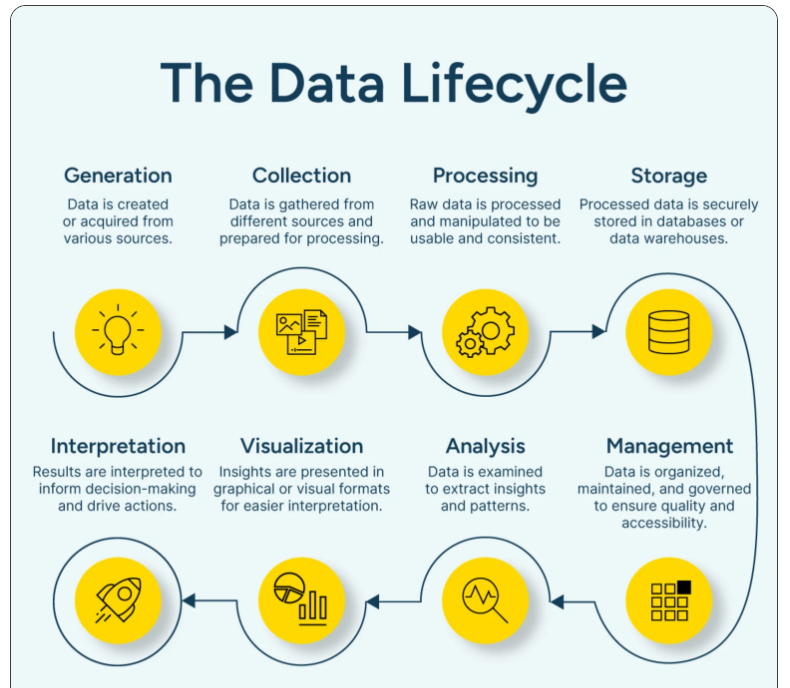

## First Course : Data Engineering with Python and AL / LLMs -Data Loading Tutorial 

### What I will learn 
- 🍉 1. Extracting Data from APIs & Handling API Challenges – Work with REST APIs, authentication, rate limits, retries, and pagination to extract data efficiently.

- 🍉 2. Schema Management & Automatic Normalization – Use dlt to infer schemas, flatten nested JSON, extract lists into child tables, and handle schema evolution automatically.

- 🍉 3. Incremental Data Extraction & State Tracking – Load only new or modified records, avoiding unnecessary reprocessing and improving pipeline efficiency.

- 🍉 4. Loading Data into Various Destinations – Store data in DuckDB, BigQuery, Snowflake, or a Data Lake while ensuring efficient schema mapping and performance.

- 🍉 5. Automating & Orchestrating Pipelines – Deploy, schedule, and maintain ingestion workflows with Dagster, GitHub Actions, and Cron Jobs.

- 🍉 6. Scaling Data Pipelines Efficiently – Handle large-scale data ingestion while optimizing performance, retries, and parallel execution.

## What is data ingestion ? 
###  Data ingestion is the process of extracting data from a source, transporting it to a suitable environment, and preparing it for use. This often includes normalizing, cleaning, and adding metadata.
- Data Ingestion Process

- Extract Data – Retrieving data from a source

- Normalize Data – Standardizing data formats

- Clean Data – Removing inconsistencies

- Add Metadata – Enhancing data with additional information

- Transport Data – Moving data to a suitable environment.
## Data Streaming vs Batching 

###  When extracting data,you need to decide how to process it:
- Batching :Processing data in chunks at scheduled intervals.
- Streaming : Processing data continuously as it arrives. 

 ## Introduction to Data Engineering

-  What is data engineering, roles and responsibilities?[Source[1]]
 - - Data engineers are necessary to ensure that data is collected, stored, and made accessible for analysis. They are the architects behind the scenes, responsible for building, maintaining, and organizing the infrastructure that enables organizations to leverage data effectively. In essence, data engineers bridge the gap between raw data and actionable insights, making them a crucial asset in data-driven decision-making.
 - -  Data Engineer Roles and Responsibilities
1. Data Collection and Integration
Data engineers collect data from various sources, including databases, APIs, external data providers, and streaming sources. They must design and implement efficient data pipelines to ensure a smooth flow of information into the data warehouse or storage system.

2. Data Storage and Management
Once the data is collected, data engineers are responsible for its storage and management. This involves choosing appropriate database systems, optimizing data schemas, and ensuring data quality and integrity. They also must consider scalability and performance to handle large volumes of data.

3. ETL (Extract, Transform, Load) Processes
ETL is a fundamental process in data engineering. Data engineers design ETL pipelines to transform raw data into a format suitable for analysis. This involves data cleansing, aggregation, and enrichment, ensuring the data is usable for data scientists and analysts.

4. Big Data Technologies
In today's data landscape, dealing with big data is the norm rather than the exception. Data engineers work with big data technologies such as Hadoop and Spark to efficiently process and analyze massive datasets.

5. NoSQL Databases
In addition to traditional relational databases, data engineers often work with NoSQL databases like MongoDB and Cassandra, which are well-suited for handling unstructured or semi-structured data.

6. Cloud Computing
Cloud platforms like AWS, Azure, and Google Cloud have become the backbone of modern data infrastructure. Data engineers leverage these platforms to build scalable and cost-effective data solutions.

7. Distributed Systems
Data engineering often involves distributed systems architecture to handle huge data volumes and ensure fault tolerance. Understanding how distributed systems work is essential for data engineers.

8. Streaming Data
Real-time data processing is crucial in many industries. Data engineers work with streaming technologies like Apache Kafka to handle and analyze data as it flows in
### Tools and Technologies in Data Engineering
Data engineers leverage a variety of tools and technologies to build and maintain data infrastructure. Some of the key tools include:

Database Management Systems (DBMS): MySQL, PostgreSQL, MongoDB
Data Warehousing Solutions: Amazon Redshift, Google BigQuery, Snowflake
<b>Big Data Technologies </b>: Apache Hadoop, Apache Spark
ETL Tools: Talend, Apache Nifi, Microsoft Azure Data Factory
Data Orchestration Tools: Apache Airflow, Prefect, Luigi

- Data lifecycle (collection → storage → processing → analysis → usage).
-  

